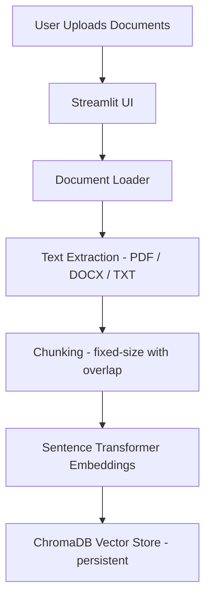
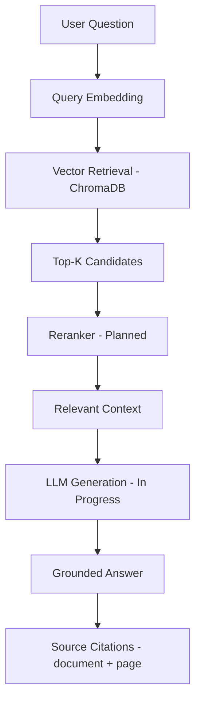

# DocuMind — Production RAG Document Intelligence Platform


DocuMind is being developed as a scalable **Retrieval-Augmented Generation (RAG)** platform for querying large collections of documents using semantic retrieval and LLM-based generation. Users upload documents and ask natural-language questions; the system retrieves the most relevant passages and produces grounded answers with source references.

> **Status note:** DocuMind is under active development. Core retrieval components are implemented, while the LLM generation layer, evaluation suite, FastAPI API, and containerized deployment are planned. This README accurately reflects the current state of the repository and clearly distinguishes **Implemented**, **In Progress**, and **Planned** functionality.

---

## Overview

**The problem.** Traditional document search requires users to manually open and scan large PDFs, DOCX, or text files to find the information they need. This is slow, error-prone, and does not scale to large or multi-document collections.

**The solution.** DocuMind lets users upload documents and ask natural-language questions. The system:

1. Extracts text from each document.
2. Splits the text into searchable chunks.
3. Embeds each chunk using a sentence transformer.
4. Stores the embeddings in a ChromaDB vector database.
5. Retrieves the most relevant chunks for a question using semantic similarity.
6. Generates a grounded answer (LLM generation layer currently in development).

**Large-document architecture (intended).** The platform is designed to scale to large documents through page-wise extraction, chunk-level indexing, batched embeddings, and persistent vector storage — so only relevant chunks, not entire documents, are sent to the LLM. Batch/asynchronous ingestion is planned and has **not** been implemented or tested at scale yet; no specific page limit is claimed.

---

## Key Features

| Feature | Status |
| --- | --- |
| Multi-document upload | Implemented |
| PDF support | Implemented |
| DOCX support | Implemented |
| TXT support | Implemented |
| Large-document ingestion | Planned |
| Intelligent text chunking | Implemented (fixed-size with overlap; semantic chunking planned) |
| Metadata extraction | In Progress (source + page metadata attached to chunks) |
| Sentence Transformer embeddings | Implemented |
| ChromaDB vector storage | Implemented (persistent) |
| Semantic similarity search | Implemented |
| Top-K retrieval | Implemented (default K = 5) |
| Cross-encoder reranking | Planned |
| Claude API integration | In Progress |
| Ollama / local LLM support | Planned |
| Grounded answer generation | In Progress |
| Source / page citations | Implemented (retrieval metadata + UI display) |
| Conversation history | Implemented (in-session chat history) |
| FastAPI REST API | Planned |
| RAG evaluation | Planned |
| Docker deployment | Planned |
| Production deployment | Planned |

---

## System Architecture

### Document ingestion (implemented)



### Query flow (implemented retrieval; LLM generation in progress)



---

## RAG Pipeline

The complete intended pipeline:

1. **Document upload** — user uploads PDF, DOCX, or TXT files.
2. **Document parsing** — the file is parsed by type-specific loaders (`rag/document_loader.py`).
3. **Text extraction** — PDF pages are extracted with PyMuPDF; DOCX paragraphs and TXT content are read directly.
4. **Intelligent chunking** — text is split into overlapping chunks with source/page metadata (`rag/chunker.py`).
5. **Metadata generation** — each chunk is tagged with its source file and page number.
6. **Embedding generation** — chunks are embedded with `all-MiniLM-L6-v2` (`rag/embeddings.py`).
7. **Vector storage** — embeddings are persisted in ChromaDB (`rag/vector_store.py`).
8. **Query embedding** — the user's question is embedded with the same model.
9. **Semantic retrieval** — the top-K most similar chunks are returned (`rag/retriever.py`).
10. **Candidate reranking** — *planned*: a cross-encoder re-scores candidates before generation.
11. **Context construction** — retrieved chunks are assembled with source labels (`rag/rag_pipeline.py`).
12. **LLM generation** — *in progress*: context + question are sent to an LLM for a grounded answer.
13. **Source citation** — the answer is shown alongside its document/page sources.

**Why reranking is useful.** Vector search provides fast candidate retrieval by comparing embedding distances, but it can miss fine-grained relevance. A cross-encoder performs a more precise query–passage relevance scoring over the retrieved candidates, so only the most on-topic passages are passed to the LLM for generation.

---

## Large Document Architecture

The system is designed to handle large documents through:

- **Batch processing** — *planned*: documents processed in batches rather than all at once.
- **Page-wise extraction** — implemented for PDFs; each page becomes an indexable unit.
- **Chunk-level indexing** — implemented; chunks are the retrieval unit stored in ChromaDB.
- **Batched embeddings** — implemented (documents are embedded in batches at ingestion).
- **Persistent vector storage** — implemented via ChromaDB `PersistentClient`.
- **Metadata filtering** — *planned*: filtering retrieval by source/page metadata.
- **Background / asynchronous ingestion** — *planned*: uploads processed without blocking the UI.

### Intended large-document flow (planned design, not yet validated at scale)

```text
1000-page document
        ↓  page-wise extraction
page 1, page 2, ... page 1000
        ↓  chunking
thousands of chunks
        ↓  batched embeddings
embedding batches
        ↓  persistent vector database (ChromaDB)
stored vectors
        ↓  semantic retrieval (top-K)
top relevant chunks
        ↓  reranking (planned)
most relevant passages
        ↓  LLM generation (in progress)
grounded answer
```

> The entire document is **never** sent to the LLM for every question. Only the top relevant chunks are retrieved and used as context, keeping generation fast and focused. No specific page limit is claimed, as large-document throughput has not yet been benchmarked.

---

## Technology Stack

| Layer | Technology | Purpose |
| --- | --- | --- |
| Frontend | Streamlit (`app.py`) | Upload UI, chat interface, source display |
| Backend | Python | Core logic, document processing, RAG pipeline |
| RAG — Embeddings | Sentence Transformers (`all-MiniLM-L6-v2`) | Semantic embedding of chunks and queries |
| RAG — Vector Store | ChromaDB | Persistent vector storage and similarity search |
| RAG — Reranking | Cross-encoder | *Planned* — precise query–passage re-scoring |
| LLM | Claude API (Anthropic) / Ollama | *In Progress / Planned* — answer generation |
| REST API | FastAPI | *Planned* — programmatic API access |
| Containerization | Docker | *Planned* — reproducible deployment |
| Testing | Pytest | *Planned* — automated tests not yet added |
| Evaluation | RAG evaluation scripts | *Planned* — retrieval + generation metrics |

---

## Project Structure

The current repository layout:

```text
Documind-RAG-Platform/
├── app.py                     # Streamlit UI — upload, chat, source citations
├── rag/                       # RAG pipeline modules
│   ├── __init__.py
│   ├── document_loader.py     # PDF / DOCX / TXT text extraction
│   ├── chunker.py             # Fixed-size chunking with overlap + metadata
│   ├── embeddings.py          # Sentence Transformer embedding module
│   ├── vector_store.py        # ChromaDB persistent vector store
│   ├── retriever.py           # Semantic similarity retrieval (top-K)
│   ├── llm.py                 # LLM module (in development)
│   └── rag_pipeline.py        # Retrieve → context → generate orchestration
├── utils/
│   ├── __init__.py
│   └── helpers.py             # Utility helpers (placeholder)
├── data/
│   ├── chroma/                # ChromaDB persistent storage (gitignored)
│   └── uploads/               # Uploaded documents (gitignored)
├── backend/                   # Backend scaffolding (Dockerfile placeholder)
├── frontend/                  # Placeholder — the UI is Streamlit in app.py
├── evaluation/                # Placeholder — RAG evaluation suite (planned)
├── tests/                     # Placeholder — automated tests (planned)
├── docs/                      # Placeholder — documentation (planned)
├── docker-compose.yml         # Placeholder — empty, Docker not yet wired
├── requirements.txt           # Python dependencies
├── .env                       # Local environment variables (gitignored)
├── .gitignore
└── README.md
```

### Planned architecture

The following are scaffolded but **not yet implemented**:

- `backend/` — an actual FastAPI backend with API endpoints.
- `evaluation/` — RAG evaluation dataset and metric scripts.
- `tests/` — automated unit/integration tests.
- `docs/` — project documentation.
- A real `Dockerfile` and `docker-compose.yml` for containerized deployment.

---

## API Design

No REST API endpoints exist yet. A FastAPI layer is **planned** with the following intended endpoints:

| Method | Endpoint | Status |
| --- | --- | --- |
| POST | `/api/documents/upload` | Planned |
| GET | `/api/documents` | Planned |
| DELETE | `/api/documents/{id}` | Planned |
| POST | `/api/chat` | Planned |
| POST | `/api/search` | Planned |
| GET | `/api/health` | Planned |

Until then, the application is interacted with exclusively through the Streamlit UI.

---

## RAG Evaluation

Evaluation is **planned** and will follow standard RAG evaluation methodology using a question/answer/source dataset that compares retrieval results and generated answers against expected outcomes.

**Retrieval metrics:**
- **Recall@K** — fraction of relevant documents retrieved within the top-K results.
- **Precision@K** — fraction of the top-K results that are relevant.
- **MRR (Mean Reciprocal Rank)** — how early the first relevant result appears.
- **Hit Rate** — whether at least one relevant result appears in the top-K.

**Generation metrics:**
- **Faithfulness** — whether the answer is supported by the retrieved context.
- **Answer Relevance** — how well the answer addresses the question.
- **Context Relevance** — how relevant the retrieved context is to the question.

No scores are reported yet, as the evaluation suite has not been built or run.

---

## Installation

Windows PowerShell instructions:

```powershell
git clone https://github.com/Prajwal6300/Documind-RAG-Platform.git

cd Documind-RAG-Platform

python -m venv venv

.\venv\Scripts\Activate.ps1

pip install -r requirements.txt
```

`requirements.txt` contains the actual project dependencies:

```
streamlit
anthropic
chromadb
sentence-transformers
pymupdf
python-docx
python-dotenv
numpy
```

---

## Environment Variables

The project loads environment variables via `python-dotenv` and stores them in a local `.env` file (which is gitignored). The variables below are configured in the repository's `.env` and are intended for the planned Claude integration — they are not yet consumed by the code.

| Variable | Description | Example |
| --- | --- | --- |
| `ANTHROPIC_API_KEY` | API key for the Claude (Anthropic) API | `ANTHROPIC_API_KEY=your_api_key_here` |
| `CLAUDE_MODEL` | Claude model identifier used for generation | `CLAUDE_MODEL=your_claude_model_id` |

> Never commit your real API keys. The `.env` file is excluded by `.gitignore`.

---

## Running the Application

The current entry point is the Streamlit app:

```powershell
.\venv\Scripts\Activate.ps1

streamlit run app.py
```

This launches the DocuMind UI where you can upload PDF, DOCX, and TXT documents, ask questions in natural language, and view retrieved source citations.

> **Development note:** The answer-generation module (`rag/llm.py`) is currently in development — the pipeline builds the retrieval context and returns sources, but the LLM `generate_answer` step has not been fully implemented yet.

### Planned Production Run

A production run is planned and will involve:

- A FastAPI backend served behind a reverse proxy.
- Containerized services via Docker Compose (API, vector store, frontend).
- Persistent vector storage mounted outside the container.
- Environment-based configuration of LLM providers.

These components are **planned** and do not run today.

---

## Docker

Docker deployment is **planned**. The repository contains placeholder files (`backend/Dockerfile`, `docker-compose.yml`) that are currently empty and not yet functional. No Docker commands are documented yet.

---

## Example Workflow

1. **Upload `Employee_Handbook.pdf`** — done via the Streamlit sidebar.
2. **System extracts text** — implemented (`rag/document_loader.py`).
3. **Document is split into chunks** — implemented (`rag/chunker.py`).
4. **Embeddings are generated** — implemented (`rag/embeddings.py`).
5. **Chunks are stored in ChromaDB** — implemented (`rag/vector_store.py`).
6. **User asks: "What is the annual leave policy?"** — implemented (chat input).
7. **Vector retrieval finds relevant chunks** — implemented (`rag/retriever.py`).
8. **Reranker selects the most relevant passages** — planned.
9. **LLM generates an answer** — in progress.
10. **UI displays answer with document/page source** — implemented (source expander).

Steps 8–9 are marked as planned/in progress and are not yet fully functional.

---

## Security Considerations

- **Never commit `.env`** — the `.env` file is gitignored and holds API keys.
- **Never expose API keys** — keep secrets in environment variables or a secret manager.
- **Validate uploaded files** — verify file types before processing.
- **Limit upload size** — enforce size limits to avoid resource exhaustion (planned).
- **Sanitize filenames** — prevent path traversal and unsafe filenames (planned).
- **Apply authentication before production deployment** — planned.
- **Restrict API access** — planned for the FastAPI layer.
- **Protect vector database storage** — keep the ChromaDB persistence directory secure and access-controlled.

---

## Scalability

Planned scalability improvements (not yet implemented):

- Background document processing
- Batch embedding
- Persistent vector database (ChromaDB persistence is implemented; scale-up patterns planned)
- Metadata filtering
- Async FastAPI endpoints
- Queue-based ingestion
- Object storage for uploaded documents
- PostgreSQL + pgvector as a future alternative for larger deployments

---

## Testing

Automated testing is part of the development roadmap. The `tests/` directory is currently empty and no test suite or test runner is configured yet.

---

## Roadmap

- [x] Document loading (PDF, DOCX, TXT)
- [x] Text chunking with metadata
- [x] Sentence Transformer embedding pipeline
- [x] ChromaDB persistent vector storage
- [x] Semantic similarity search with top-K retrieval
- [x] Source/page citation metadata
- [x] Streamlit UI with in-session conversation history
- [ ] Multi-document ingestion
- [ ] Large-document batch processing
- [ ] Semantic chunking
- [ ] Embedding pipeline optimizations (batched/async)
- [ ] ChromaDB persistence hardening
- [ ] Hybrid retrieval
- [ ] Cross-encoder reranking
- [ ] Claude integration
- [ ] Ollama integration
- [ ] Source citations (LLM-grounded)
- [ ] FastAPI API layer
- [ ] RAG evaluation
- [ ] Automated tests
- [ ] Docker
- [ ] Authentication
- [ ] Production deployment
- [ ] Monitoring and logging

---

## Resume Highlights

- **Retrieval-Augmented Generation** — end-to-end RAG pipeline design: ingestion, indexing, retrieval, and generation.
- **Large-document processing** — architecture for scaling beyond single-document chat.
- **Semantic search** — dense vector embeddings for meaning-based retrieval.
- **Vector databases** — persistent storage and similarity search with ChromaDB.
- **Reranking** — cross-encoder reranking designed to improve retrieval precision (planned).
- **LLM integration** — provider-agnostic design for Claude and local Ollama models (in progress).
- **REST API development** — planned FastAPI layer for programmatic access.
- **RAG evaluation** — planned retrieval and generation metric framework.
- **Docker** — planned containerized deployment.
- **Production architecture** — focus on scalability, security, and maintainability.

---

## Future Improvements

- Hybrid BM25 + vector search
- Query rewriting
- Multi-query retrieval
- Parent-child chunking
- OCR for scanned PDFs
- Table-aware document parsing
- Streaming responses
- Authentication / RBAC
- PostgreSQL + pgvector
- Observability (metrics, logging, tracing)
- Caching (query and embedding caching)
- Cloud object storage
- Distributed background workers

---

## License

MIT License (to be added when the repository license is finalized).

---

## Author

**Prajwal Yadav**

GitHub: [https://github.com/Prajwal6300](https://github.com/Prajwal6300)
