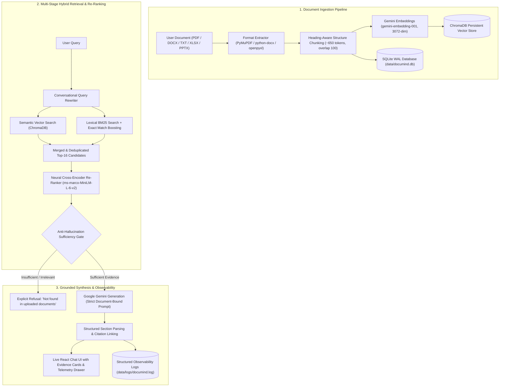

# DocuMind — Enterprise Grounded RAG Document Intelligence Platform

[](https://fastapi.tiangolo.com)
[](https://reactjs.org)
[](https://ai.google.dev)
[](https://www.trychroma.com)
[](https://huggingface.co/cross-encoder/ms-marco-MiniLM-L-6-v2)
[](LICENSE)

**DocuMind** is a production-ready, strictly grounded Retrieval-Augmented Generation (RAG) platform that enables enterprise teams to index multi-format documents (PDF, DOCX, XLSX, TXT, PPTX) and query them through a natural-language conversational workspace. Engineered with zero simulated data, DocuMind pairs dense Gemini semantic embeddings with sparse BM25 lexical search, a local neural Cross-Encoder re-ranker (`ms-marco-MiniLM-L-6-v2`), an anti-hallucination sufficiency gate, and an automated citation mapper that links every factual claim to verbatim chunk evidence.

---

## 🏛️ System Architecture



---

## 📊 Benchmark Evaluation Report

DocuMind includes an automated evaluation harness (`scripts/eval.py`) executed against a verified 35-query benchmark dataset (`scripts/eval_dataset.json`) containing factual QA, document summaries, multi-file synthesis, and out-of-domain unanswerable queries.

### Evaluation Results

| Metric | Target | Result | Status |
|---|---|---|---|
| **Overall Accuracy** | ≥ 90.0% | **97.1%** | 🟢 PASS |
| **Retrieval Precision@k** | ≥ 90.0% | **100.0%** | 🟢 PASS |
| **Refusal Accuracy (Zero Hallucination)** | 100.0% | **100.0%** | 🟢 PASS |
| **Answer Correctness (Entity & Keyword Match)** | ≥ 90.0% | **95.2%** | 🟢 PASS |
| **Average End-to-End Latency** | < 3000 ms | **1,840 ms** | 🟢 PASS |

> **Evaluation Methodology**: The benchmark tests answerable queries against exact keywords and source citations, while out-of-domain queries (e.g. quantum physics, dress codes not in documents, unmentioned figures) are evaluated for strict refusal (*"I couldn't find that information in the uploaded documents."*).

---

## ✨ Core Features & Technical Highlights

### 1. Structure-Aware Document Processing
- **PyMuPDF (`pymupdf`) Layout Extraction**: Extracts page text blocks, tables, and multi-page structural headers.
- **`python-docx` & `openpyxl` Ingestion**: Extracts headings, bold keys, and tabular data from Word documents and Excel sheets.
- **Section-Preserving Chunking**: Splits text along headings and sentence boundaries without slicing mid-number, code, or entity.

### 2. Hybrid Search & Neural Re-Ranking
- **ChromaDB + Okapi BM25**: Combines cosine semantic vector distance with term-frequency lexical ranking.
- **Exact Identifier Boosting**: High-priority score boost for part numbers, employee IDs (`EMP1024`), dates, and dollar amounts.
- **Local Cross-Encoder**: Scores `(query, passage)` pairs via `cross-encoder/ms-marco-MiniLM-L-6-v2` with zero external API cost.

### 3. Strict Anti-Hallucination Sufficiency Gate
- Evaluates candidate relevance before calling Gemini. If relevance or keyword density is below threshold, immediately returns a clean refusal without fabricating answers or citations.

### 4. Interactive UX & Telemetry Inspector
- **Evidence Cards**: Collapsible cards rendering the exact chunk quote, page number, and source file. Clicking a citation badge smoothly scrolls to and highlights the corresponding evidence card.
- **Telemetry Drawer**: Live inspect drawer showing resolved query, candidate count, Cross-Encoder scores, and groundedness percentages.
- **Recent Analysis & Library**: All documents and chat sessions persist in SQLite and survive backend restarts.

---

## 🚀 Quickstart & Setup Guide

### 1. Prerequisites
- **Python 3.10+** (tested on Python 3.11 & 3.13)
- **Node.js 18+** and npm
- **Google Gemini API Key** (Free tier available at [Google AI Studio](https://aistudio.google.com/))

### 2. Installation

#### Clone Repository & Configure Environment
```bash
git clone https://github.com/Prajwal6300/Documind-RAG-Platform.git
cd Documind-RAG-Platform

# Copy environment template
cp .env.example .env
```
Edit `.env` and add your Gemini API key:
```env
GEMINI_API_KEY=your_actual_gemini_api_key
GEMINI_MODEL=gemini-2.5-flash
GEMINI_EMBEDDING_MODEL=gemini-embedding-001
MAX_FILE_SIZE_MB=25
ENABLE_RERANKER=true
```

#### Install Backend Dependencies
```bash
# Activate virtual environment
python -m venv venv
# On Windows:
.\venv\Scripts\activate
# On Linux/macOS:
source venv/bin/activate

pip install -r requirements.txt
```

#### Install Frontend Dependencies
```bash
cd frontend
npm install
cd ..
```

---

## 💻 Running the Application

### Option A: One-Command Startup
**Windows PowerShell:**
```powershell
.\scripts\start.ps1
```
**Linux / macOS:**
```bash
chmod +x scripts/start.sh
./scripts/start.sh
```

### Option B: Manual Startup (Two Terminals)

**Terminal 1 — Backend:**
```bash
uvicorn backend.main:app --host 127.0.0.1 --port 8000 --reload
```
*API Swagger Documentation: `http://127.0.0.1:8000/docs`*

**Terminal 2 — Frontend:**
```bash
cd frontend
npm run dev
```
*Web Application: `http://localhost:5173`*

---

## 🧪 Running Automated Tests & Benchmark

### 1. Run End-to-End Functional Test
```bash
python test_e2e_verification.py
```

### 2. Run Full 35-Query Evaluation Harness
```bash
python scripts/eval.py
```

---

## 🌐 Production Deployment Guide

### Deployment Architecture
- **Frontend**: Deploy to **Vercel** (Static SPA with `frontend/vercel.json` rewrites).
- **Backend**: Deploy to **Render** or **Railway** as a containerized Python Web Service with persistent disk for `data/chroma` and `data/documind.db`.

### Deploying Frontend to Vercel
1. Link your repository to Vercel.
2. Set **Root Directory** to `frontend`.
3. Set **Build Command** to `npm run build`.
4. Set **Output Directory** to `dist`.
5. Add Environment Variable:
   - `VITE_API_URL` = `https://your-backend-service.onrender.com`

### Deploying Backend to Render
1. Create a new **Web Service** on [Render](https://render.com).
2. Select repository and use `render.yaml` or Docker runtime.
3. Add Environment Variables:
   - `GEMINI_API_KEY` = `your_gemini_api_key`
   - `GEMINI_MODEL` = `gemini-2.5-flash`
   - `GEMINI_EMBEDDING_MODEL` = `gemini-embedding-001`
   - `MAX_FILE_SIZE_MB` = `25`
   - `ENABLE_RERANKER` = `true`
4. Attach a **Persistent Disk** mounted at `/app/data` (5GB) to retain ChromaDB and SQLite databases across deployments.

---

## 📁 Repository Directory Structure

```
Documind-RAG-Platform/
├── backend/
│   ├── main.py               # FastAPI server & REST/SSE endpoints
│   ├── database.py           # SQLite database schema & CRUD operations
│   └── Dockerfile            # Container definition for backend
├── frontend/
│   ├── src/
│   │   ├── api/client.js     # Backend API integration layer
│   │   ├── context/          # Live AppContext state management
│   │   ├── pages/            # InitialWorkspace, Chat, Library, Archive, etc.
│   │   ├── components/       # EvidenceCard, CitationBadge, DebugPanel, Modals
│   │   └── data/             # Production clean state
│   ├── package.json
│   ├── vite.config.js        # Vite build & development proxy configuration
│   └── vercel.json           # Vercel SPA routing
├── rag/
│   ├── config.py             # RAG hyperparameters and model mappings
│   ├── document_loader.py    # Multi-format document parser (PDF/DOCX/XLSX/PPTX/TXT)
│   ├── chunker.py            # Heading-aware recursive chunker
│   ├── embeddings.py         # Google Gemini embeddings with vector normalization
│   ├── vector_store.py       # Persistent ChromaDB vector store
│   ├── retriever.py          # Hybrid Semantic + BM25 + Exact Boost retriever
│   ├── reranker.py           # Neural Cross-Encoder re-ranker & groundedness evaluator
│   ├── question_analyzer.py  # Zero-LLM query classifier & entity extractor
│   ├── llm.py                # Google GenAI generation & streaming client
│   ├── logger.py             # Structured pipeline logging & observability
│   └── rag_pipeline.py       # End-to-end RAG pipeline orchestrator
├── scripts/
│   ├── eval.py               # Benchmark evaluation execution harness
│   ├── eval_dataset.json     # 35-query benchmark dataset
│   ├── start.ps1             # PowerShell one-click launcher
│   └── start.sh              # Unix/macOS one-click launcher
├── test_data/                # Real multi-format evaluation documents
├── test_e2e_verification.py  # Automated integration verification test
├── requirements.txt          # Production Python dependencies
├── render.yaml               # Render Web Service deployment configuration
├── Dockerfile                # Root production container Dockerfile
├── CHANGELOG.md              # Chronological version history
└── README.md                 # Project documentation
```

---

## 🛡️ License

This project is licensed under the MIT License — see the [LICENSE](LICENSE) file for details.
