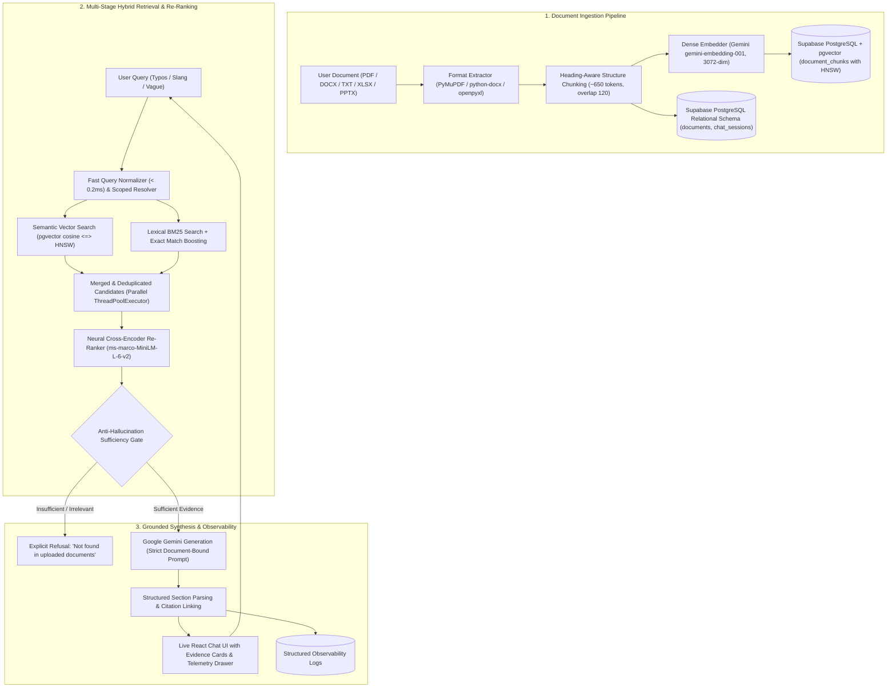

# DocuMind System Architecture

## Overview

DocuMind is an enterprise-grade Retrieval-Augmented Generation (RAG) platform. It provides structure-aware document ingestion, typo-tolerant query normalization, high-precision parallel hybrid retrieval, Cross-Encoder re-ranking, and grounded generation backed by Google Gemini and Supabase PostgreSQL + pgvector.

---

## 1. Production Deployment Topology

```
┌────────────────────────────────────────────────────────┐
│   Vercel Global Edge Network                           │
│   Frontend Client SPA (React 18 + Vite + Tailwind)     │
│   URL: https://documind-rag-platform.vercel.app        │
└───────────────────────────┬────────────────────────────┘
                            │ HTTPS (REST & Server-Sent Events SSE)
                            │ Configured via VITE_API_BASE_URL
┌───────────────────────────▼────────────────────────────┐
│   Render Containerized Web Service (FastAPI)           │
│   URL: https://documind-rag-platform.onrender.com      │
│   - Startup Cross-Encoder Re-Ranker                    │
│   - Fast Query Normalizer & Scoped Resolver            │
│   - Concurrent Candidate Retrieval (ThreadPoolExecutor)│
│   - Anti-Hallucination Sufficiency Gate                │
│   - Groundedness Evaluator & Citation Mapper           │
└──────────────┬──────────────────────────┬──────────────┘
               │                          │
┌──────────────▼──────────────┐  ┌────────▼──────────────┐
│  Google Gemini API          │  │  Supabase PostgreSQL  │
│  - gemini-embedding-001     │  │  - PostgreSQL 17.6    │
│  - gemini-2.5-flash         │  │  - pgvector 0.8.2     │
│  - google-genai SDK v2      │  │  - 3072-dim HNSW idx  │
└─────────────────────────────┘  └───────────────────────┘
```

---

## 2. High-Level RAG Pipeline Flow



---

## 2. Storage Layer: Supabase PostgreSQL + pgvector

### Schema Overview

1. **`documents`**:
   - `id VARCHAR(64) PRIMARY KEY`
   - `name TEXT NOT NULL`
   - `title TEXT NOT NULL`
   - `type VARCHAR(16) NOT NULL`
   - `size VARCHAR(32) NOT NULL`
   - `size_bytes BIGINT NOT NULL`
   - `pages INTEGER NOT NULL DEFAULT 0`
   - `chunks INTEGER NOT NULL DEFAULT 0`
   - `file_path TEXT NOT NULL`
   - `status VARCHAR(32) NOT NULL DEFAULT 'processing'`
   - `error_message TEXT`
   - `is_archived BOOLEAN NOT NULL DEFAULT FALSE`
   - `archived_at TIMESTAMPTZ`
   - `created_at TIMESTAMPTZ NOT NULL DEFAULT NOW()`
   - `updated_at TIMESTAMPTZ NOT NULL DEFAULT NOW()`

2. **`document_chunks`**:
   - `id TEXT PRIMARY KEY`
   - `document_id TEXT NOT NULL REFERENCES documents(id) ON DELETE CASCADE`
   - `source TEXT NOT NULL`
   - `chunk_index INTEGER NOT NULL`
   - `page INTEGER DEFAULT 1`
   - `section TEXT DEFAULT ''`
   - `text TEXT NOT NULL`
   - `metadata JSONB DEFAULT '{}'::jsonb`
   - `embedding vector NOT NULL`

3. **`chat_sessions`**:
   - `id TEXT PRIMARY KEY`
   - `title TEXT NOT NULL`
   - `document_count INTEGER DEFAULT 0`
   - `is_archived BOOLEAN NOT NULL DEFAULT FALSE`
   - `archived_at TIMESTAMPTZ`
   - `created_at TIMESTAMPTZ NOT NULL DEFAULT NOW()`
   - `updated_at TIMESTAMPTZ NOT NULL DEFAULT NOW()`

4. **`chat_messages`**:
   - `id TEXT PRIMARY KEY`
   - `session_id TEXT NOT NULL REFERENCES chat_sessions(id) ON DELETE CASCADE`
   - `sender VARCHAR(16) NOT NULL`
   - `content TEXT NOT NULL`
   - `sources_json JSONB DEFAULT '[]'::jsonb`
   - `sections_json JSONB DEFAULT '[]'::jsonb`
   - `evidences_json JSONB DEFAULT '[]'::jsonb`
   - `no_context BOOLEAN NOT NULL DEFAULT FALSE`
   - `timestamp TEXT NOT NULL`
   - `created_at TIMESTAMPTZ NOT NULL DEFAULT NOW()`

### Vector Indexing & Distance Metric

- **HNSW Index on 3072-Dimensional Embeddings**:
  Postgres `pgvector` limits standard 32-bit float indexing to $\le 2000$ dimensions. Using pgvector 0.8.2+, 3072-dimensional Gemini embeddings are indexed using `halfvec` (16-bit float) indexing:
  ```sql
  CREATE INDEX idx_chunks_embedding_hnsw 
  ON document_chunks USING hnsw ((embedding::halfvec(3072)) halfvec_cosine_ops);
  ```

- **Distance Metric Parity**:
  pgvector's `<=>` operator computes cosine distance $d_{\text{cos}} = 1 - \cos(u, v)$.
  Normalized Euclidean distance squared equals $2 - 2\cos(u, v) = 2 \cdot d_{\text{cos}}$.
  The vector store scales distance as `calibrated_distance = 2.0 * cos_dist`, achieving 1:1 numerical parity with all existing thresholds (`RELEVANCE_THRESHOLD = 1.48`, `STRONG_RELEVANCE_THRESHOLD = 1.20`).

---

## 3. Transaction Pooler Compatibility

DocuMind uses `psycopg` with `prepare_threshold=None` to ensure complete compatibility with Supavisor transaction-mode poolers (port `6543`), preventing duplicate prepared statement errors across connection reuse.
